# GOLDEN KEY INMOBILIARIA FRONTEND

Esta es la **aplicación frontend de Golden Key Inmobiliaria**, desarrollada en **Vue**, diseñada para interactuar con la API de Golden Key Inmobiliaria y ofrecer una experiencia de usuario fluida, moderna y segura para la gestión de usuarios, inmuebles, etc.

⚠️ **Dependencia:** Esta aplicación consume la API de Golden Key Inmobiliaria, por lo que requiere que el backend esté funcionando.

# 📸 Capturas de pantalla

<details>
<summary><strong>📂 Mostrar / Ocultar capturas</strong></summary>

<br>

### **INICIO**
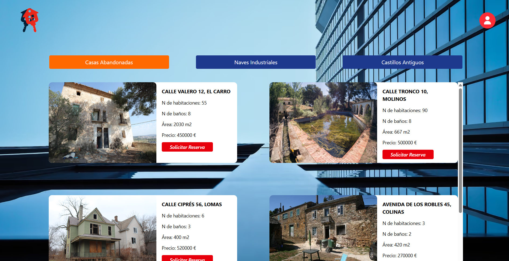

### **LOGIN**
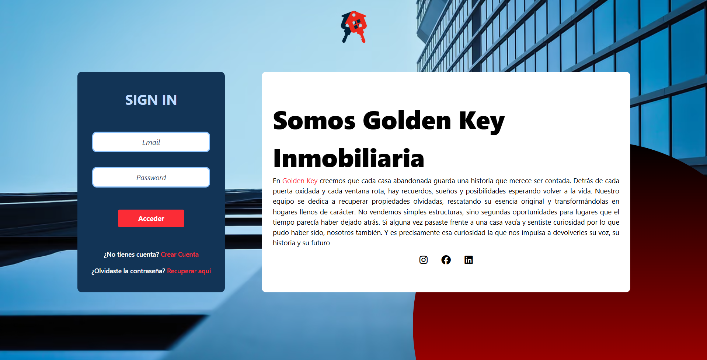

### **REGISTER**
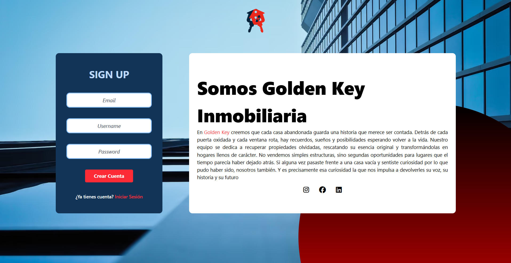

### **FORGOT PASSWORD**
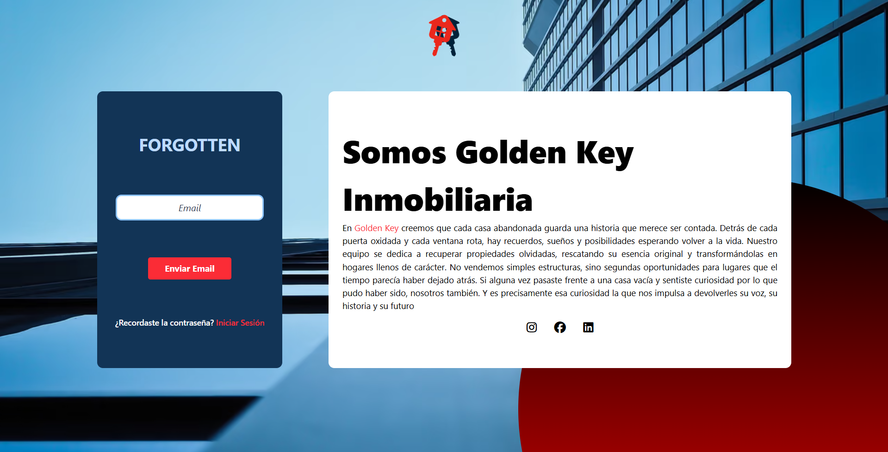

### **CHANGE PASSWORD**
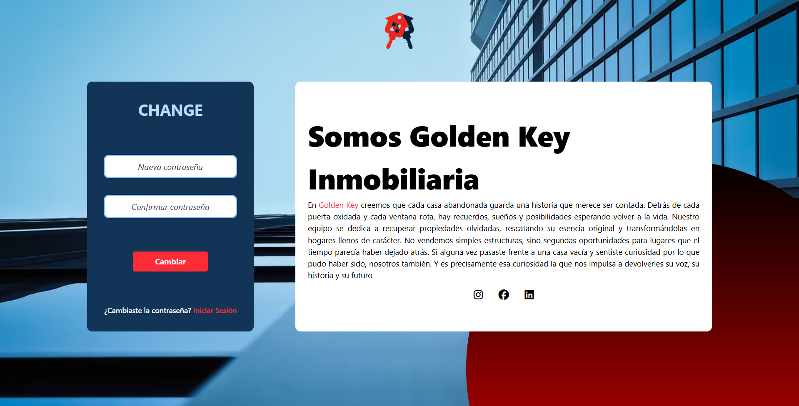

### **PERFIL DEL USUARIO**
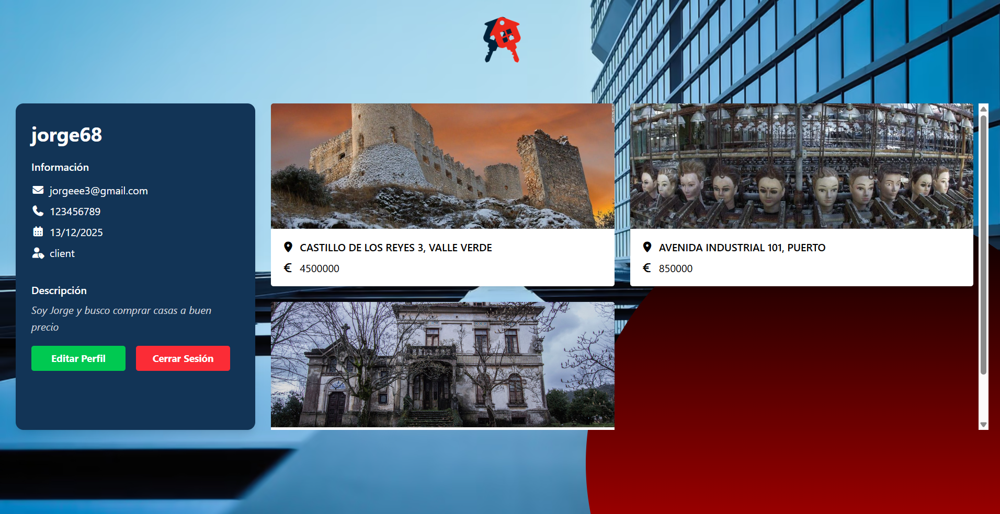

### **COMPRAR CASA**
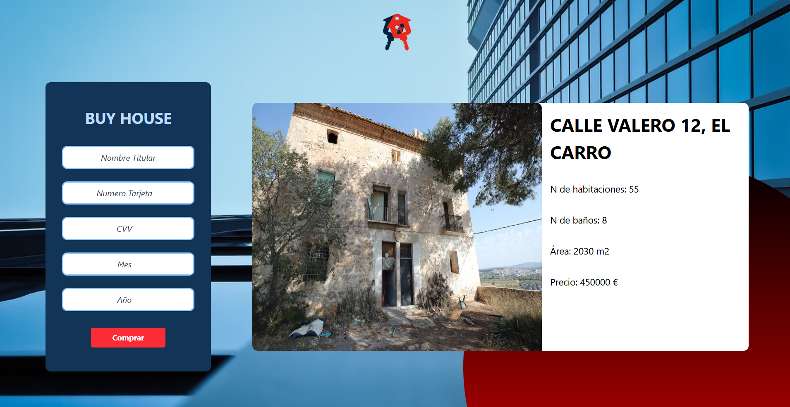

### **MENSAJE DE COMPRA EXITOSA DESDE EL CORREO**
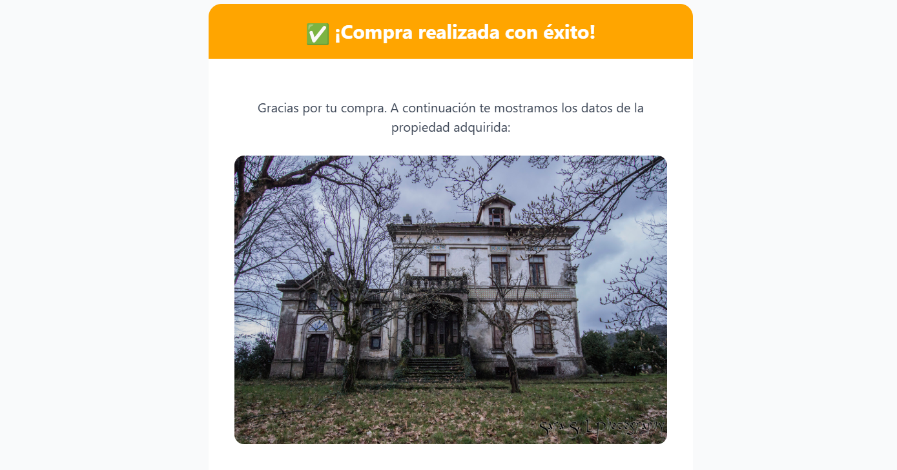

### **PERFIL DEL ADMIN**
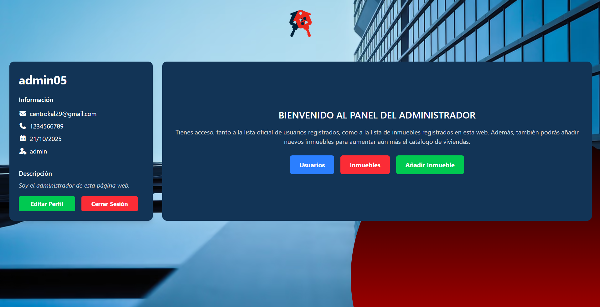

### **PANEL DE USUARIOS**
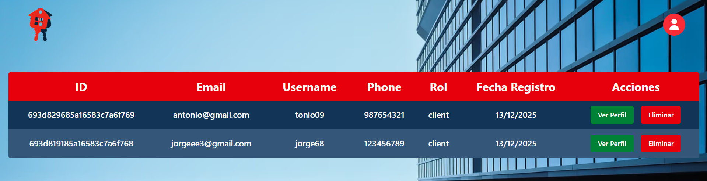

### **PANEL DE INMUEBLES**
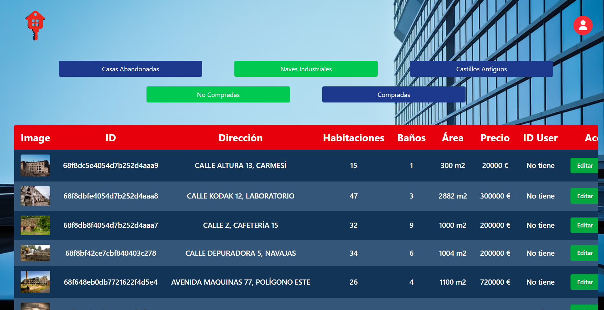

### **AÑADIR INMUEBLE**
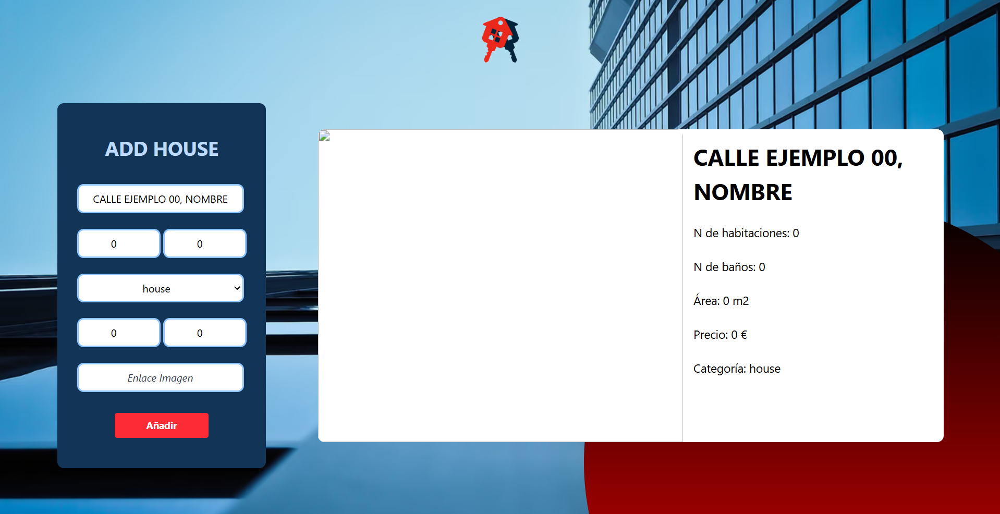

### **404**
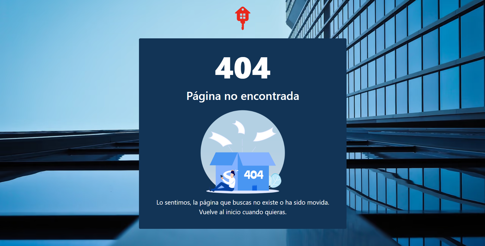

</details>

## Funcionalidades principales

### Autenticación y gestión de sesión
- Registro y login de usuarios mediante el uso de **JWT**.
- Recuperación de contraseña con integración de token enviado por email.
- Persistencia de sesión usando cookies seguras.

### Usuarios
- Visualización y edición de perfil de usuario.
- Visualización de inmuebles comprados por el usuario.

### Inmuebles
- Se puede visualizar y comprar los inmuebles, pudiendo filtrar y escoger el preferido.
- Visualizar los comprados en el perfil.

### Administrador
- Puede ver, editar y eliminar a todos los usuarios, o borrar sus compras.
- Puede ver, editar, eliminar y crear inmuebles.

### Consumo de API
- Uso de **fetch** con credenciales (`credentials: 'include'`) para interactuar con el backend.
- Manejo de respuestas y errores, mostrando notificaciones al usuario.
- Integración de **CSRF token** para formularios sensibles.

### Routing y protección de rutas
- Rutas implementadas con **vue-router**.
- Redirección automática según el estado de autenticación del usuario.

### Notificaciones y feedback
- Uso de **toast** con vue-sonner para alertar sobre acciones exitosas o errores.
- Mensajes claros cuando fallan operaciones críticas.

### Seguridad y buenas prácticas
- Protección de formularios sensibles con **CSRF tokens**.
- Protcción de rutas. Si un usuario no está logueado no puede ver rutas como el perfil.

### .env (Rellenar con sus datos correspondientes)
   ```bash
    VUE_APP_API_URL=
   ```

## Project setup
```
npm install
```

### Compiles and hot-reloads for development
```
npm run serve
```

### Compiles and minifies for production
```
npm run build
```

### Lints and fixes files
```
npm run lint
```

### Customize configuration
See [Configuration Reference](https://cli.vuejs.org/config/).
